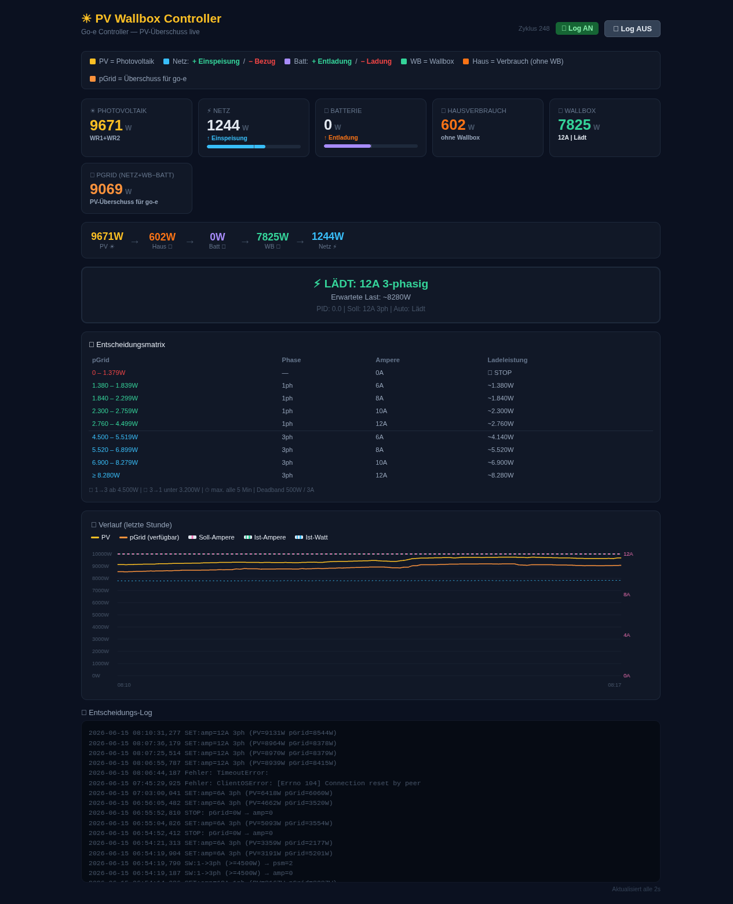

# ☀️ go-e PV Controller

**Standalone PV surplus charging controller** for go-e Gemini wallboxes with Sungrow inverters. Runs independently of Home Assistant — but coexists peacefully alongside it.



## Why Standalone?

There are excellent Home Assistant integrations for both Sungrow and go-e. This controller takes a different approach:

- **Direct hardware access** — Modbus TCP to the inverter, HTTP to the wallbox
- **No MQTT, no YAML automations, no template sensors**
- **Shorter control chain** → less latency, fewer failure points
- **Runs alongside HA** — your existing sungrow-bridge / HA setup remains untouched

This isn't a "better HA." It's a **dedicated tool** for one job: pushing PV surplus into your car with precision.

```
┌──────────────────┐     Modbus TCP      ┌──────────────────┐
│  Sungrow SH8.0RT │ ◄──────────────────► │                  │
│   (WR1 + WR2)    │                      │   go-e PV        │
└──────────────────┘                      │   Controller     │
                                          │   (Python)       │
┌──────────────────┐     HTTP API         │                  │
│  go-e Gemini V4   │ ◄──────────────────► │   Port 8088      │
│  (Wallbox)        │                      │   Dashboard      │
└──────────────────┘                      └──────────────────┘
                                                  │
                                          ┌───────┴───────┐
                                          │  history.json  │
                                          │  simulator.log │
                                          │  config.yaml   │
                                          └───────────────┘
```

## Features

### Control Logic
- **PV-driven amp selection** — `pGrid / (230V × phases)` yields the optimal charging current
- **Automatic phase switching** 1-phase ↔ 3-phase with hysteresis
- **Safe transitions** — amp=0 → switch phases → new amp (protects the go-e)
- **5-minute cooldown** between phase switches to prevent cloud-induced flapping
- **500 W deadband** — ignores minor fluctuations
- **Grid-import guard** — pGrid=0 whenever power is drawn from the grid

### Dashboard (Port 8088)
- Live values: PV, grid, battery, house load, wallbox, pGrid
- **Decision matrix** — all 9 charging stages at a glance
- **1-hour chart** (survives controller restarts)
- Scrollable decision log with error tracking
- Toggleable logging via button
- Auto-refresh every 2 seconds via WebSocket

### Reliability
- Modbus fallback: holds last valid readings on timeout
- No PID windup, no lingering integrals
- Rotating log (max 4 MB), writes only on state changes
- systemd user service with auto-restart

## Hardware

| Component | Model | Connection |
|-----------|-------|------------|
| WR1 | Sungrow SH8.0RT | Modbus TCP `192.168.178.151:502` |
| WR2 | Sungrow (secondary) | Modbus TCP `192.168.178.154:502` |
| Wallbox | go-e Gemini V4, FW 60.5 | HTTP API `192.168.178.200` |
| Host | Raspberry Pi 4B, Debian 13 | — |

> **Different hardware?** The controller uses Sungrow Modbus registers (13007, 13009, 13021, 5016). For other inverters, adjust the register addresses in `controller.py`. The go-e HTTP control works with all Gemini models.

## Installation

```bash
git clone https://github.com/tobwil/goe-pv-controller.git
cd goe-pv-controller

python3 -m venv venv
source venv/bin/activate
pip install -r requirements.txt
```

### Configuration

Edit `config.yaml`:

```yaml
goe:
  ip: "192.168.178.200"     # Your go-e IP
  max_amps: 12              # Hardware limit
  min_amps: 6               # Below 6A, no car will charge
  min_power_w: 1380         # 6A × 230V (1-phase minimum)

phase_switch:
  hysteresis_up: 4500       # Switch 1→3 phase above this
  hysteresis_down: 3200     # Switch 3→1 phase below this
  min_switch_interval: 300  # 5 min cooldown

deadband:
  amps: 3                   # Only change if Δ ≥ 3A
  watts: 500                # Only change if Δ ≥ 500W

simulation:
  enabled: false            # false = LIVE control, true = log only
  log_file: "/path/to/simulator.log"

history:
  file: "/path/to/history.json"

web:
  host: "0.0.0.0"
  port: 8088
```

### systemd Service

```bash
mkdir -p ~/.config/systemd/user
cp pv-wallbox-controller.service ~/.config/systemd/user/

# Adjust paths in the service file:
# WorkingDirectory=/path/to/goe-pv-controller
# ExecStart=/path/to/goe-pv-controller/venv/bin/python .../web_ui.py

systemctl --user daemon-reload
systemctl --user enable --now pv-wallbox-controller

# Check status
systemctl --user status pv-wallbox-controller
```

## Dashboard

Available at `http://<host>:8088`

### Top: Live Values
Five cards display PV production, grid feed-in/draw, battery charge/discharge, house consumption, and wallbox load. The **pGrid** value is the available surplus — the control variable.

### Middle: Decision Matrix

| pGrid | Phase | Amps | Charging Power |
|-------|-------|------|---------------|
| 0 – 1,379 W | — | 0 A | 🛑 STOP |
| 1,380 – 1,839 W | 1ph | 6 A | ~1,380 W |
| 1,840 – 2,299 W | 1ph | 8 A | ~1,840 W |
| 2,300 – 2,759 W | 1ph | 10 A | ~2,300 W |
| 2,760 – 4,499 W | 1ph | 12 A | ~2,760 W |
| 4,500 – 5,519 W | 3ph | 6 A | ~4,140 W |
| 5,520 – 6,899 W | 3ph | 8 A | ~5,520 W |
| 6,900 – 8,279 W | 3ph | 10 A | ~6,900 W |
| ≥ 8,280 W | 3ph | 12 A | ~8,280 W |

Phase switching uses hysteresis: upshift at 4,500 W, downshift at 3,200 W. Between these thresholds, the current phase is held — no flip-flopping on cloudy days.

### Bottom: Chart & Log
The 1-hour chart shows pGrid, PV, target amps, and actual amps. Below it, the decision log captures timeouts, connection errors, and switching decisions.

### API

| Endpoint | Method | Description |
|----------|--------|-------------|
| `/` | GET | Dashboard HTML |
| `/api/state` | GET | JSON: sensors, decision, history, logs |
| `/api/toggle_log` | POST | Toggle logging on/off |
| `/ws` | WebSocket | Live push (every 2s) |

## pGrid — The Core Metric

`pGrid` is the **available surplus for the wallbox**, in watts. The formula accounts for battery charging and grid import:

```
If battery charging:      pGrid = grid_feedin + wallbox_load
If battery discharging:   pGrid = grid_feedin + wallbox_load − battery_discharge
If grid importing (< −50W): pGrid = 0  (no surplus available)
```

This ensures the wallbox runs on 100% PV surplus — no grid draw, no battery drain.

## Phase Switching — How It Works

Switching phases under load can damage the go-e. The controller handles this safely:

1. **amp=0** → wallbox stops charging
2. **0.5s pause** → go-e processes the stop
3. **psm=X** → set phase mode (1=1ph, 2=3ph)
4. **amp=Y** → set new amperage

The entire sequence takes under 1 second and only occurs every ≥5 minutes.

## Coexistence with Home Assistant

The controller runs **independently** but doesn't interfere with HA:

- **sungrow-bridge** stays untouched — HA continues receiving PV data
- **go-e integration** in HA keeps running — you see charging status as usual
- The controller only **reads** (Modbus → inverter) and **writes** to the go-e (amp, psm)
- No MQTT topic overlap, no duplicate sensors

You can run this controller without touching your HA setup at all.

## Troubleshooting

| Symptom | Cause | Solution |
|---------|-------|----------|
| Controller stops immediately (pGrid=0) | No PV surplus or grid import | Normal during clouds/night |
| "Connection reset by peer" in log | Brief Modbus disconnect | Harmless — controller uses fallback values |
| TimeoutError | Inverter or go-e temporarily unreachable | Controller retries next cycle automatically |
| Dashboard shows empty chart | Controller restarted, no history.json yet | Fills up within 1h — history persists every 30s |
| go-e not charging despite surplus | `alw=False` in go-e API | Enable charging permission in go-e app |
| Phase switching flutters | Hysteresis too tight | Widen `hysteresis_up`/`down` in config |

## Files

```
├── controller.py          # Core: Modbus, go-e API, control logic, phase switching
├── web_ui.py              # FastAPI: dashboard + API endpoints
├── config.yaml            # Configuration (IPs, thresholds)
├── requirements.txt       # Python dependencies
├── pv-wallbox-controller.service  # systemd user unit
├── templates/
│   └── dashboard.html     # Live dashboard with Chart.js
├── dashboard.png          # README screenshot
├── history.json           # Auto-generated: chart data (survives restarts)
└── simulator.log          # Decision log (rotating, max 4 MB)
```

## Roadmap

- [ ] MQTT status push (optional, for HA integration if desired)
- [ ] Config UI in dashboard
- [ ] Docker container
- [ ] Support for additional inverters (GoodWe, Fronius, Solax)

## License

MIT
